# BrainBoost

## Overview

BrainBoost is a fully featured Android-based Brain Training application developed to enhance memory, logical reasoning, concentration, and problem-solving abilities through interactive educational games. The application brings together Science, Mathematics, Memory, Puzzle, and Fun games within a modern and intuitive mobile interface.

Built using Kotlin, XML, Firebase Authentication, and Material Design Components, BrainBoost provides an engaging learning experience with user authentication, profile management, and multiple categories of brain-training activities. The application is designed to help students and learners strengthen their cognitive skills while enjoying interactive gameplay.

---

## Project Objectives

* Improve users' memory and concentration through interactive games.
* Develop logical thinking and problem-solving skills.
* Provide educational games in Science and Mathematics.
* Deliver a simple, responsive, and user-friendly mobile experience.
* Combine multiple brain-training activities into a single Android application.

---

## Key Features

### User Authentication

* User Registration
* User Login
* Forgot Password
* Secure Firebase Authentication
* Session Management

### User Experience

* Splash Screen
* Onboarding Screens
* Navigation Drawer
* User Profile
* Profile Picture Update
* Modern Material UI
* Responsive Layout Design

## Games Included

### Science Games

* Science Detective
* Mind of a Molecule
* Food Chain Builder
* Code Quiz

### Mathematics Games

* Math Quiz
* Sudoku
* Missing Number
* Speed Tap

### Memory & Puzzle Games

* Memory Card Flip
* 8 Puzzle
* 15 Puzzle
* Maze Game
* Chess

### Fun & Entertainment Games

* Word Search
* Word Scramble
* 2048 Puzzle
* Tic-Tac-Toe
---

## Technology Stack

### Frontend

* Kotlin
* XML
* Android Studio

### Authentication

* Firebase Authentication

### Libraries & Tools

* AndroidX
* RecyclerView
* Glide
* Material Design Components

---

## Internet Usage

BrainBoost requires an internet connection only for user authentication.

Internet connection is required for:

* User Registration
* User Login
* Password Reset
* Authentication Verification

All games and learning activities can be accessed after successful login.

---

## Project Architecture

```text
Presentation Layer
│
├── Activities
├── Fragments
├── XML Layouts
│
Business Logic Layer
│
├── Authentication Module
├── User Profile Module
├── Game Management Module
├── Navigation Module
│
Data Layer
│
├── Firebase Authentication
├── SharedPreferences
└── Local Game Resources
```

---

## Screenshots

## Screenshots

<table>

<tr>
<td align="center">
<b>Splash Screen</b><br>
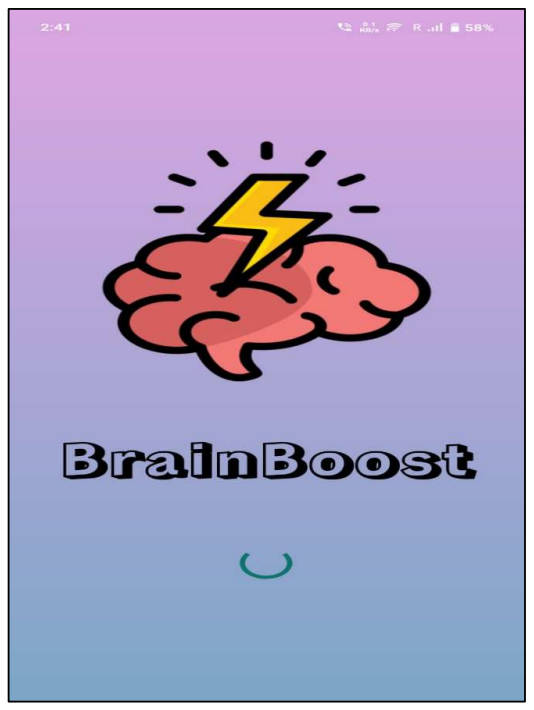
</td>

<td align="center">
<b>Onboarding Screen 1</b><br>
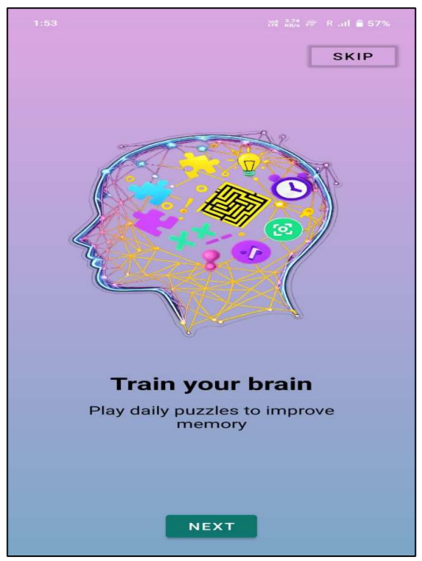
</td>
</tr>

<tr>
<td align="center">
<b>Onboarding Screen 2</b><br>
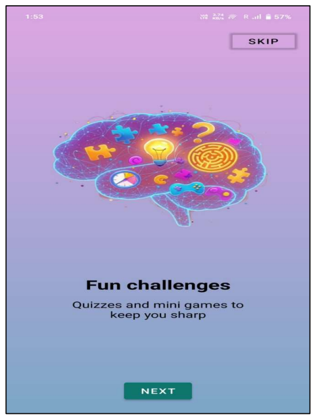
</td>

<td align="center">
<b>Onboarding Screen 3</b><br>
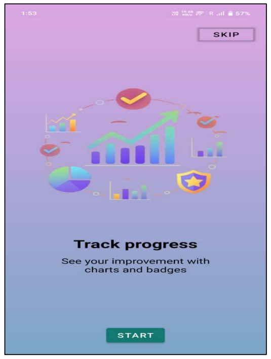
</td>
</tr>

<tr>
<td align="center">
<b>Login Screen</b><br>
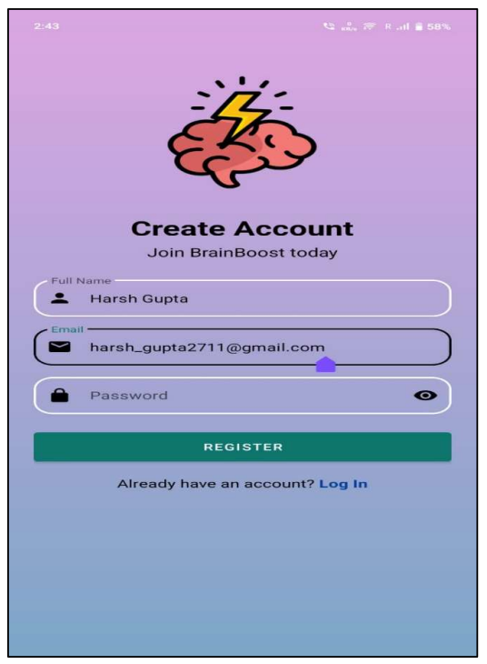
</td>

<td align="center">
<b>Sign Up Screen</b><br>

</td>
</tr>

<tr>
<td align="center">
<b>Home Screen</b><br>
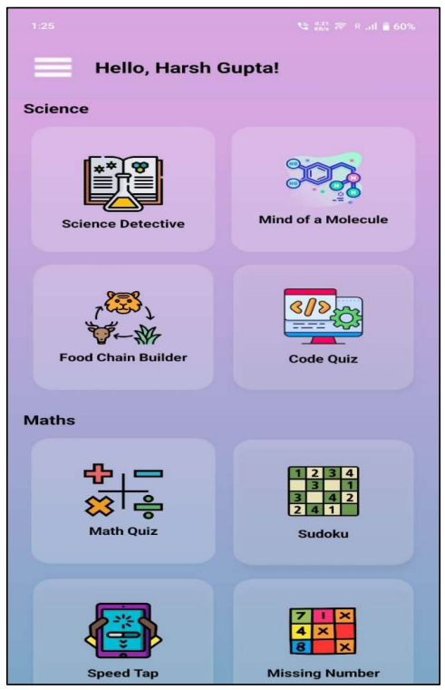
</td>

<td align="center">
<b>Home Screen (More Games)</b><br>
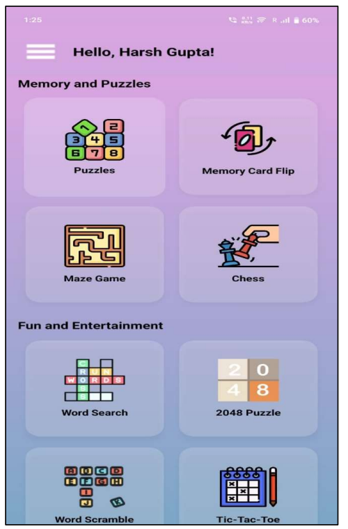
</td>
</tr>

<tr>
<td align="center">
<b>Science Detective</b><br>
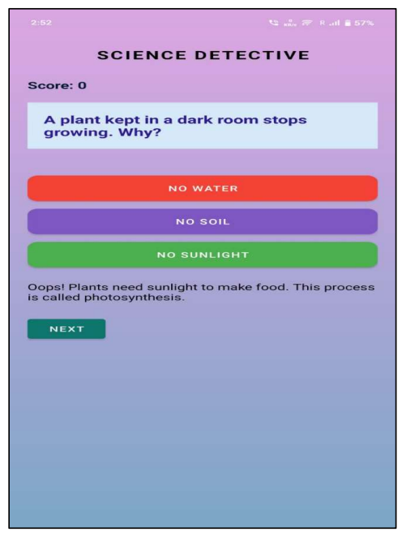
</td>

<td align="center">
<b>Mind of Molecule</b><br>
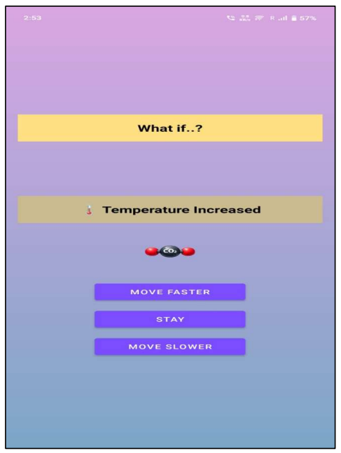
</td>
</tr>

<tr>
<td align="center">
<b>Food Chain Builder</b><br>
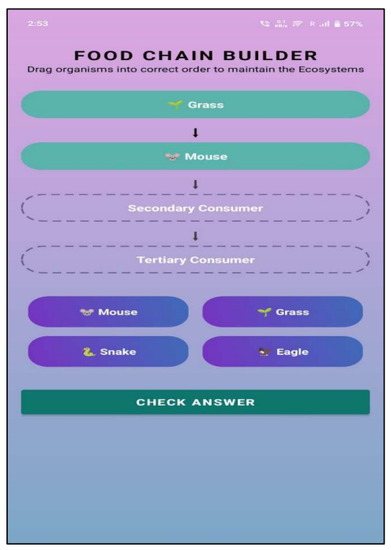
</td>

<td align="center">
<b>Code Quiz</b><br>
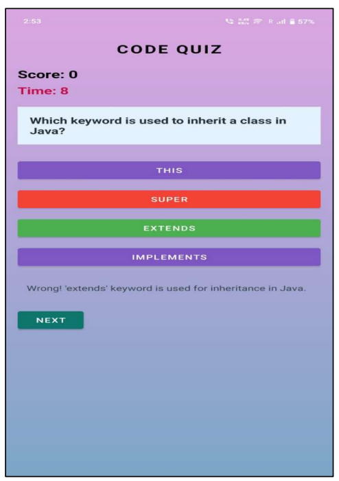
</td>
</tr>

<tr>
<td align="center">
<b>Math Quiz</b><br>
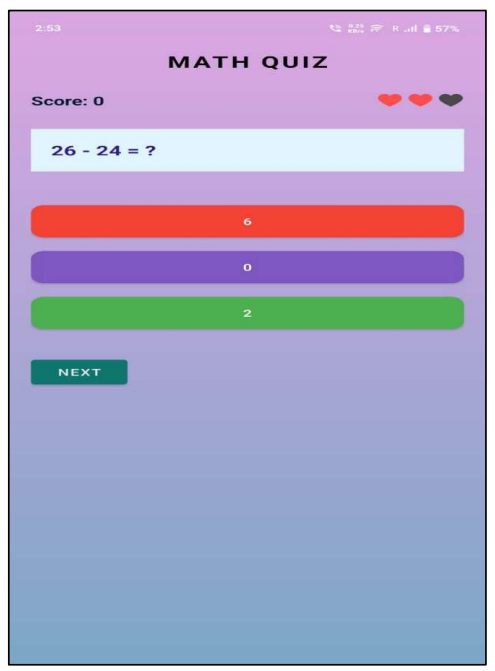
</td>

<td align="center">
<b>Sudoku</b><br>
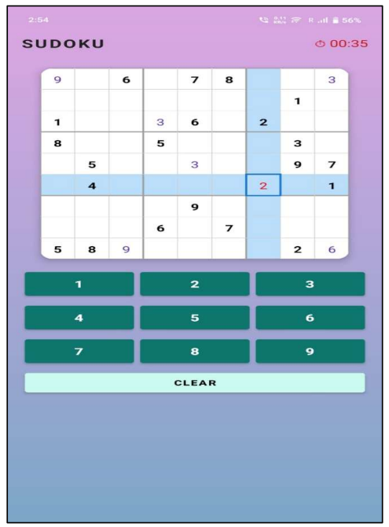
</td>
</tr>

<tr>
<td align="center">
<b>Speed Tap</b><br>
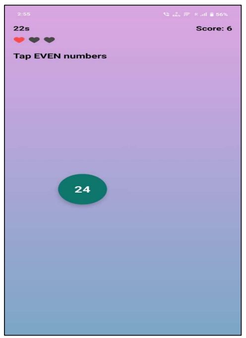
</td>

<td align="center">
<b>Missing Number</b><br>
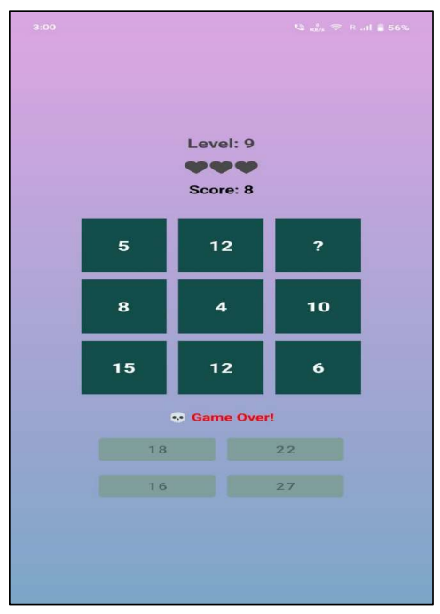
</td>
</tr>

<tr>
<td align="center">
<b>Puzzle Menu</b><br>
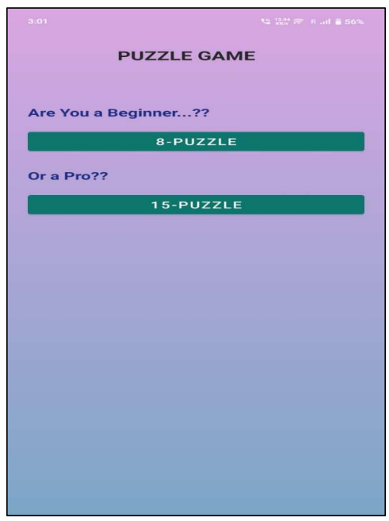
</td>

<td align="center">
<b>8 Puzzle</b><br>
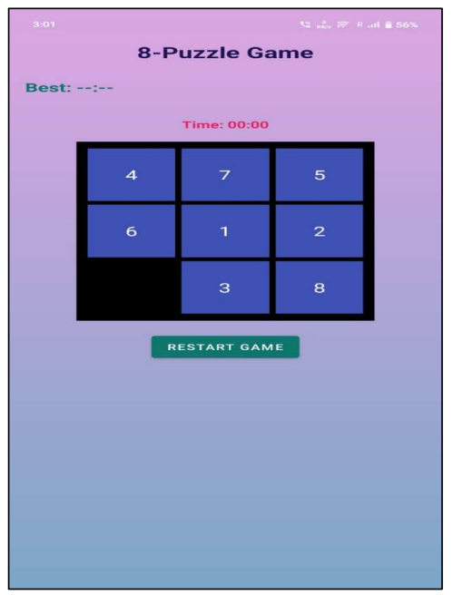
</td>
</tr>

<tr>
<td align="center">
<b>15 Puzzle</b><br>
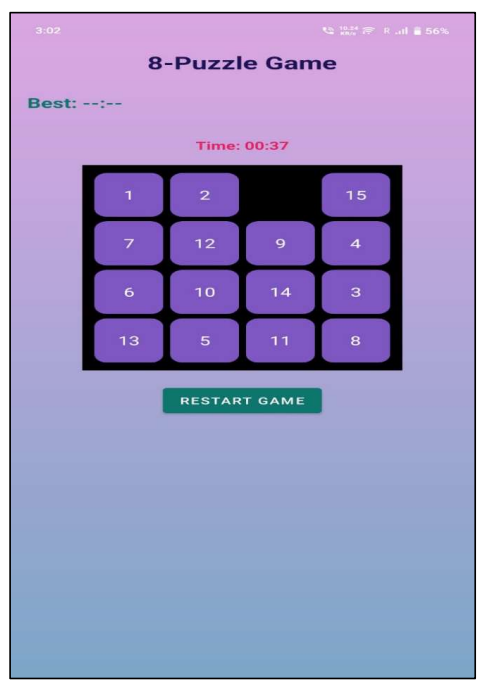
</td>

<td align="center">
<b>Memory Card Flip</b><br>
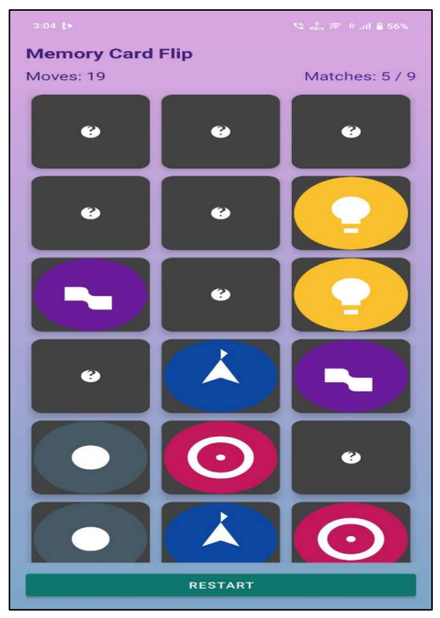
</td>
</tr>

<tr>
<td align="center">
<b>Maze Game</b><br>
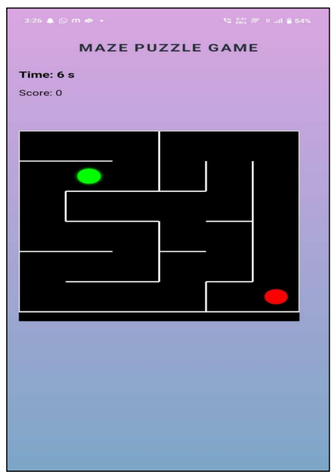
</td>

<td align="center">
<b>Chess</b><br>
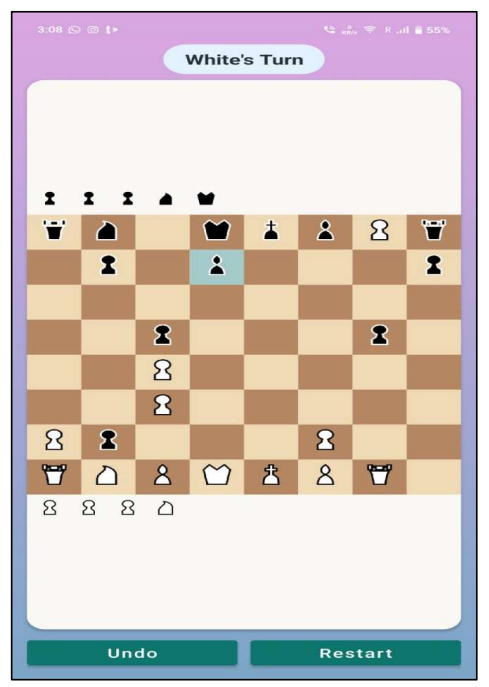
</td>
</tr>

<tr>
<td align="center">
<b>Word Search</b><br>
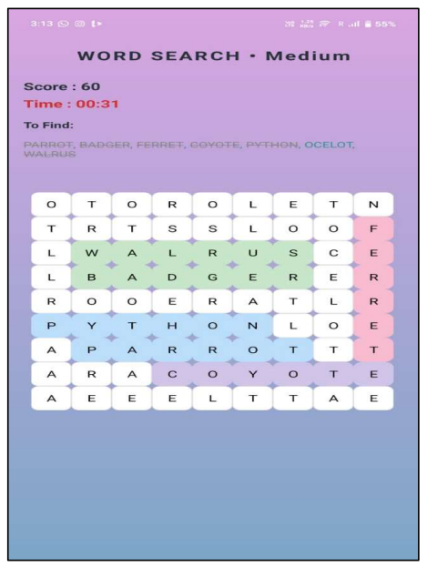
</td>

<td align="center">
<b>2048 Puzzle</b><br>
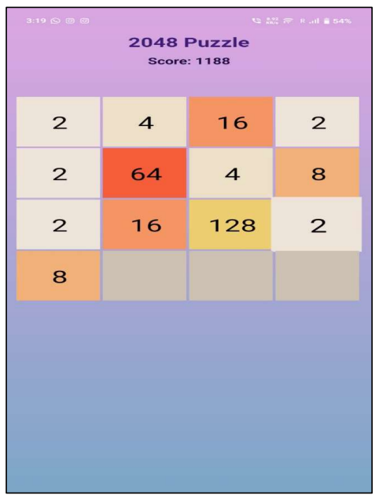
</td>
</tr>

<tr>
<td align="center">
<b>Word Scramble</b><br>
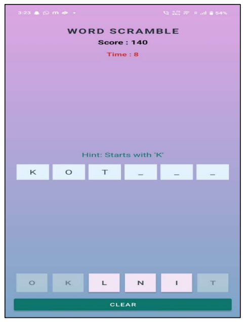
</td>

<td align="center">
<b>Tic-Tac-Toe</b><br>
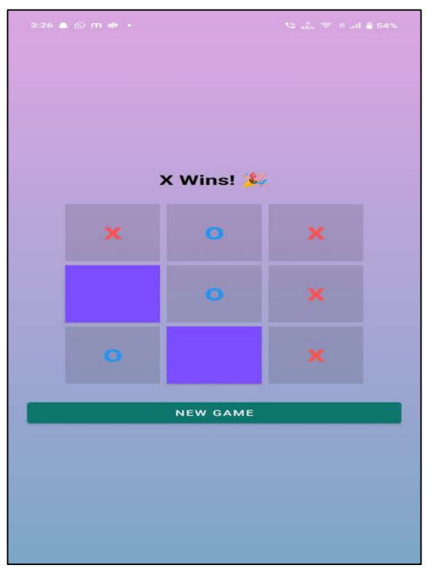
</td>
</tr>

<tr>
<td align="center">
<b>User Profile</b><br>
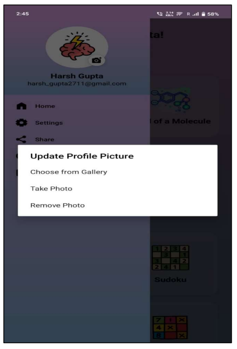
</td>

<td align="center">
<b>Logout Dialog</b><br>
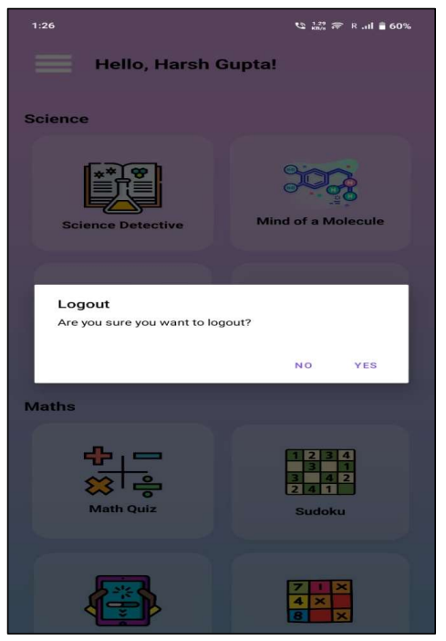
</td>
</tr>

</table>

---

## Installation Guide

### Clone Repository

```bash
git clone https://github.com/sakshigupta1410/BrainBoost.git
```

### Setup Project

1. Open Android Studio.
2. Clone or download the repository.
3. Sync Gradle files.
4. Add your Firebase Authentication configuration (`google-services.json`).
5. Build the project.
6. Run the application on an Android device or emulator.

---

## Future Enhancements

* More Brain Training Games
* Achievement & Reward System
* Daily Challenges
* Leaderboard
* Game Progress Tracking
* Difficulty Levels
* Additional Science Activities
* Enhanced User Statistics

---

## Author

**Sakshi Gupta**

Bachelor of Science in Computer Science

GitHub: https://github.com/sakshigupta1410

---

## License

This project is intended for educational and portfolio purposes.

Copyright © 2026 Sakshi Gupta. All Rights Reserved.

See the **LICENSE** file for complete license information.
